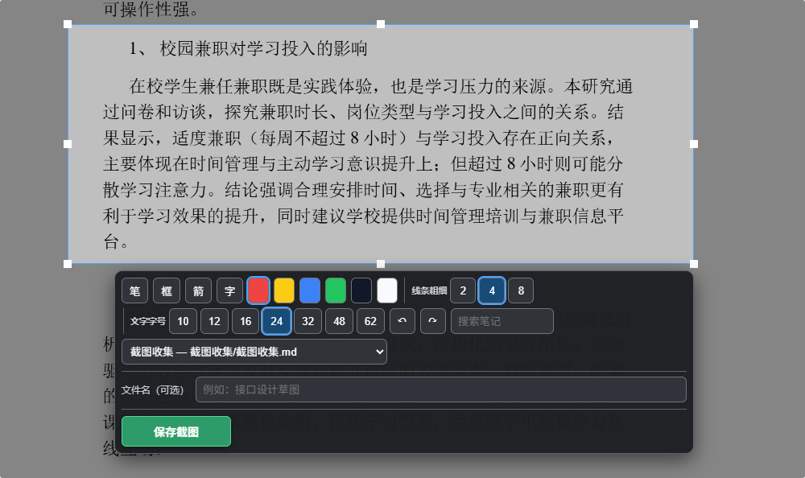

# Screenshot Inbox

Screenshot Inbox 是一款面向 Windows 桌面版 Obsidian 的截图插件。用户可以从其他应用启动截图、添加标注，并将 PNG 图片保存到 Obsidian Vault，再插入选定的 Markdown 笔记。

## 界面预览



## 功能

- 使用系统级快捷键启动截图，默认快捷键为 `Alt+Q`，也可以在插件设置中修改。
- 在屏幕上框选截图区域，并使用画笔、矩形、箭头和文字标注。
- 将截图保存到 Vault，并插入默认笔记、最近使用的笔记或搜索选定的笔记。
- 记住最近使用的笔记和标注偏好；保存失败时提供重试插入入口。
- 提供命令面板中的「开始截图」命令，作为快捷键之外的启动入口。

## 环境要求

- Windows 10/11。
- Obsidian 桌面版 1.5.7 或更高版本。
- 开发和构建需要 Node.js 与 npm。

本插件依赖 Obsidian 桌面版提供的 Electron 能力，不支持 Obsidian 移动端。

## 安装

1. 从 GitHub 仓库下载 `main.js`、`manifest.json` 和 `styles.css`。
2. 在 Vault 的插件目录中创建 `screenshot-inbox` 文件夹：

   ```text
   <Vault>/.obsidian/plugins/screenshot-inbox/
   ```

3. 将上述 3 个文件放入该文件夹。
4. 重启 Obsidian，或在「设置 → 社区插件」中刷新插件列表，然后启用「Screenshot Inbox」。

安装时不需要复制源码、`node_modules/` 或 `.release/`。

## 开发与构建

在插件目录运行：

```bash
npm ci
npm run dev
```

`npm run dev` 会监听源码变化并重新生成根目录的 `main.js`。验证和构建命令如下：

```bash
npm test
npm run typecheck
npm run build
```

创建可手动安装的运行文件目录：

```bash
npm run package:release
```

构建产物位于 `.release/screenshot-inbox/`，其中包含 `main.js`、`manifest.json` 和 `styles.css`。

## 隐私与数据

- 截图和笔记内容写入用户当前打开的 Obsidian Vault。
- 插件依赖本机 Obsidian/Electron 桌面能力，不要求账号、Token 或远程截图服务。
- 插件不需要向外部服务发送截图或笔记内容。

## 已知限制

- 仅支持 Windows 桌面版 Obsidian；不支持 macOS、Linux 和移动端。
- 截图能力依赖 Obsidian 当前提供的 Electron API；不同 Obsidian/Electron 版本可能影响兼容性。

## 许可证

本项目采用 GNU 通用公共许可证第 3 版（GPL-3.0），详见 [LICENSE](./LICENSE)。
